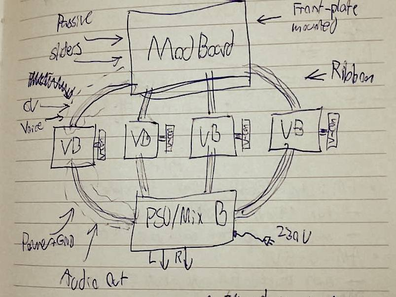
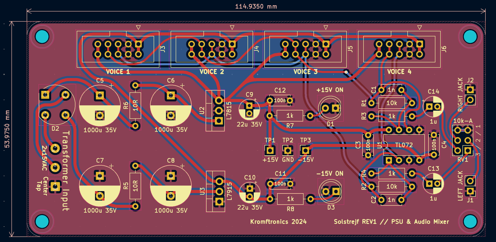
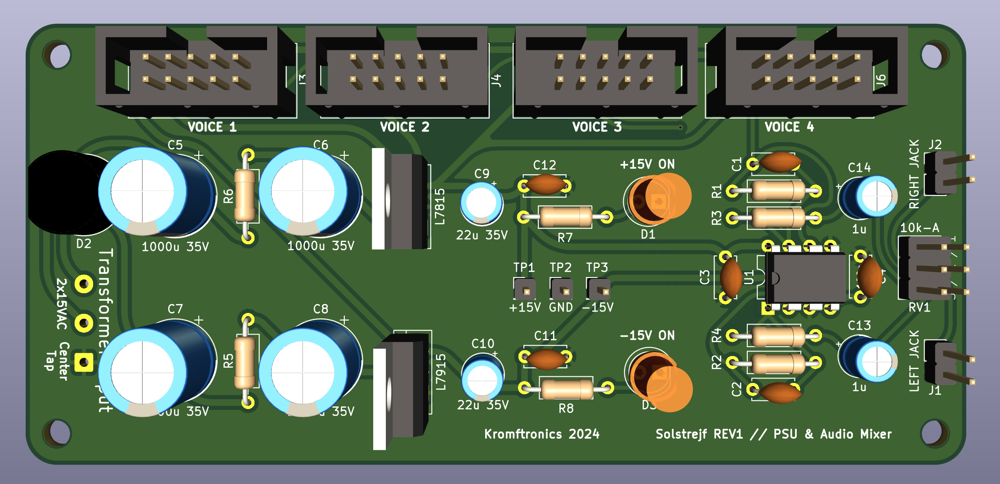
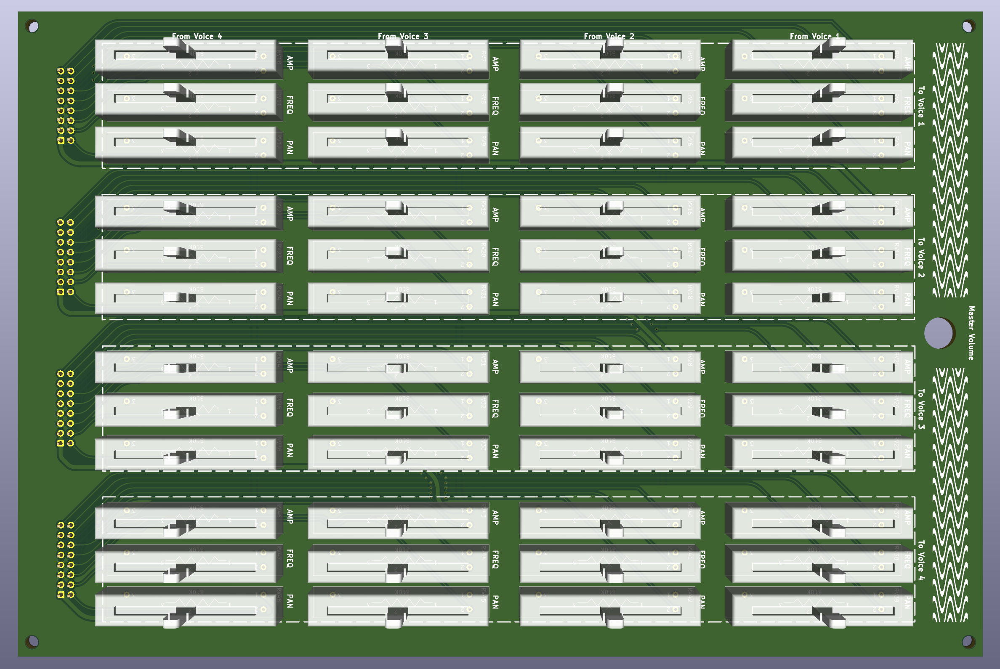
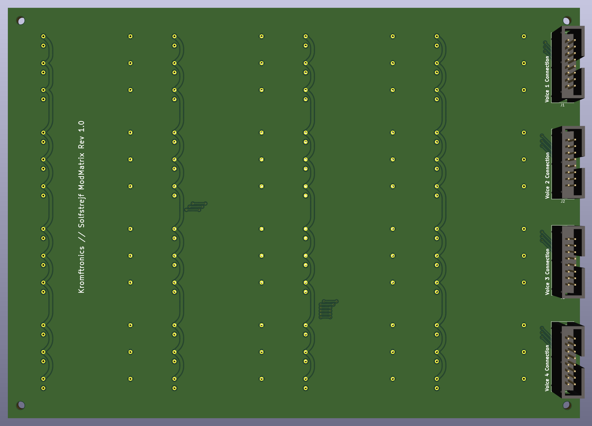

# Solstrejf - 4 Voice Sinewave Drone Oscillator
This repository contains the simulation, schematic ,and PCB files for **Solstrejf**.
Some custom KiCad footprints, 3D models, and symbols are used in this project. 
This is included as a git submodule, which means that this repo should be cloned with the `--recursive` option like so: 

```
git clone --recursive "https://github.com/KamikazeVildsvin/Solstrejf.git"
```

### Introduction & Overview
Solstrejf, roughly translated from Danish to "sun streak" or "sun touch", is a four-voice analog sine wave drone oscillator. 
I was on a hike in Sweden out near a beautiful forest lake just around the break of dawn. 
The way the sun interacted with nature gave me a real sense of calm and ease. 
At that moment I thought, what if I could create an instrument that would be able to replicate this feeling? 
A sine wave drone synthesizer came to my mind, similar to the early Musique Concrète test equipment techniques.

###### Block Diagram


I wanted the instrument to be playful and interactive. 
Four sine wave oscillators in itself are maybe not that interesting and can become static. 
A modulation matrix, which would allow for all four voices to modulate parameters like frequency and amplitude on all other voices would create more complex soundscapes. 
The basic idea and block diagram can be seen above, where four identical voice boards are connected to the mod-matrix board and a power supply/mixer board for output summation.

## PCB's - KiCad Projects
As indicated by the block diagram above, Solstrejf is broken into four different types of subblocks and PCB's:

- A Power Supply Unit (PSU) & Mixer PCB
- A Modulation Matrix PCB
- A Voiceboard PCB (x4)
- A Voiceboard Front Panel PCB (x4)

Each of these PCB's have their own KiCad project with an associated schematic. 
The [`schematics`](schematics) directory contains some of the latest prints of the different schematics. 
The revision may not match with the KiCad files, so be sure to double check the actual KiCad project files to be certain.

### PSU / Audio Mixer
Use to generate the +/-15V supply and sum all of the left and right audio channels of the four voices.

[KiCad Project Files](pcb/solstrejf-PSU-mixer/)

###### PCB


###### 3D Model : Top View


###### 3D Model : Side View


### Mod-Matrix
Connects to each of the four voice boards to route the modulation from and to each of the voices.
Each voice can modulate the amplitude, frequency and pan of all other voices.

[KiCad Project Files](pcb/solstrejf-modmatrix-pots)

###### 3D Model : Front-Side


###### 3D Model : Back-Side 


### Voiceboard 
Coming soon...

[KiCad Project Files](pcb/solstrejf-voiceboard-core/)

### Voiceboard Front Panel
Coming soon...