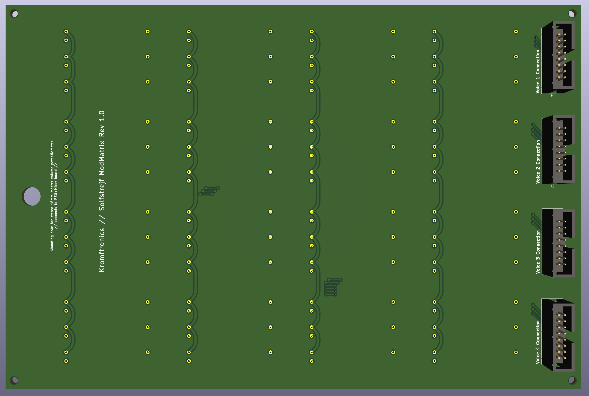

# Solstrejf - 4 Voice Sinewave Drone Oscillator
This repository contains the simulation, schematic and PCB files for **Solstrejf**.

### Introduction & Overview
Solstrejf, roughly translated from danish to "sun streak" or "sun touch", is a four voice analog sine wave drone oscillator. I was on a hike in Sweden out near a beautiful forest lake just around the break of dawn. The way the sun interacted with the nature gave me a real sense of calm and ease. In that moment I thought, *what if I could create an instrument that would be able to replicate this feeling*? A sine wave drone synthesizer came to my mind, similar to the early Musique Concrète test equiment techniques.

###### Block Diagram

I wanted the instrument to be playfull and interactive. Four sine wave oscillators in it self is maybe not that interseting and can become static. A mod-matrix, which would allow for all four voices to modulate parameters like frequency and amplitude on all other voice would create more complex sound scapes. The basic idea and block diagram can be seen above, where four identical voice boards are connected to the mod-matrix board and to a power supply/mixer board for output summation.

## Images
Below are some images and renders of the different PCB's and schematics.

### Mod-Matrix

###### 3D Model : Front-Side

###### 3D Model : Back-Side 
