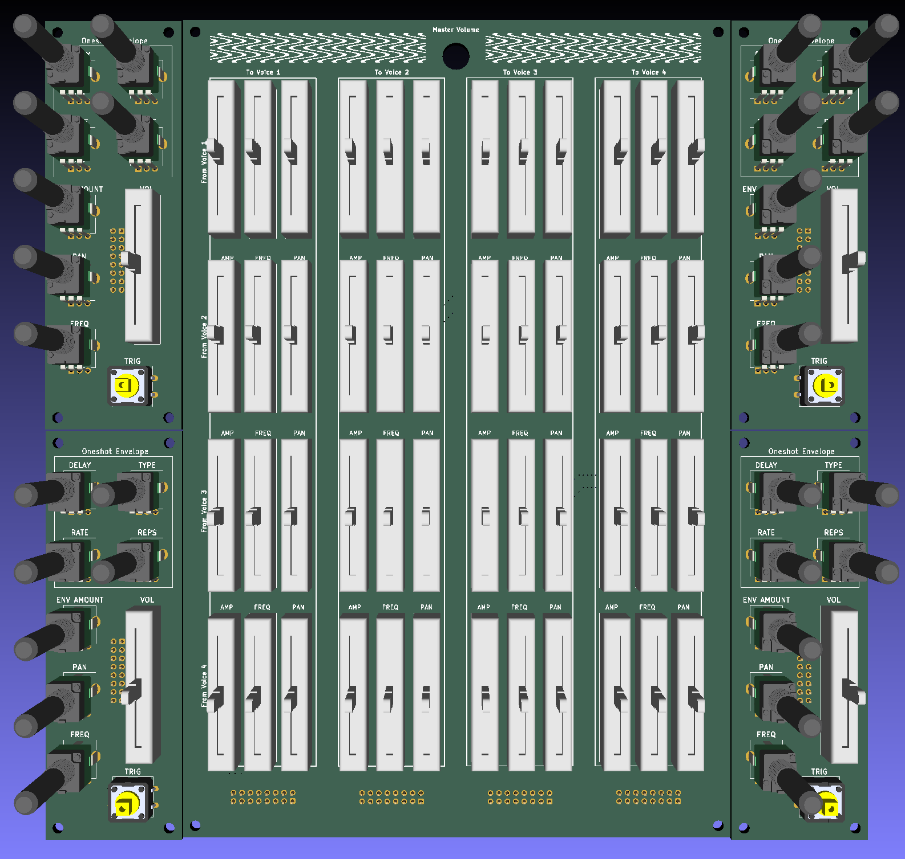
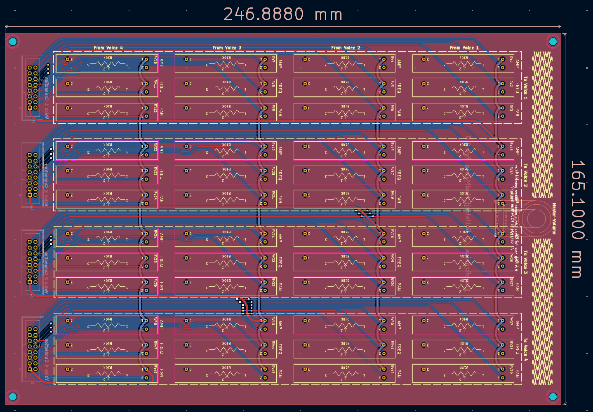
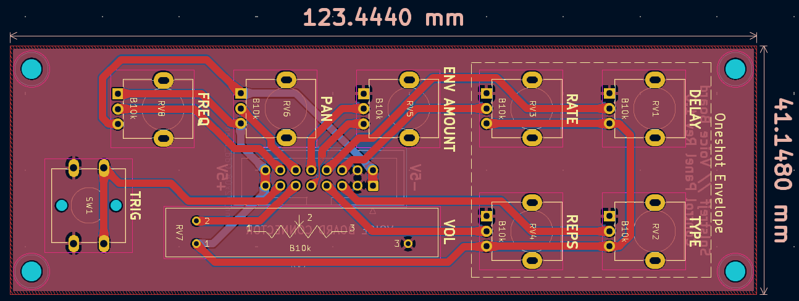
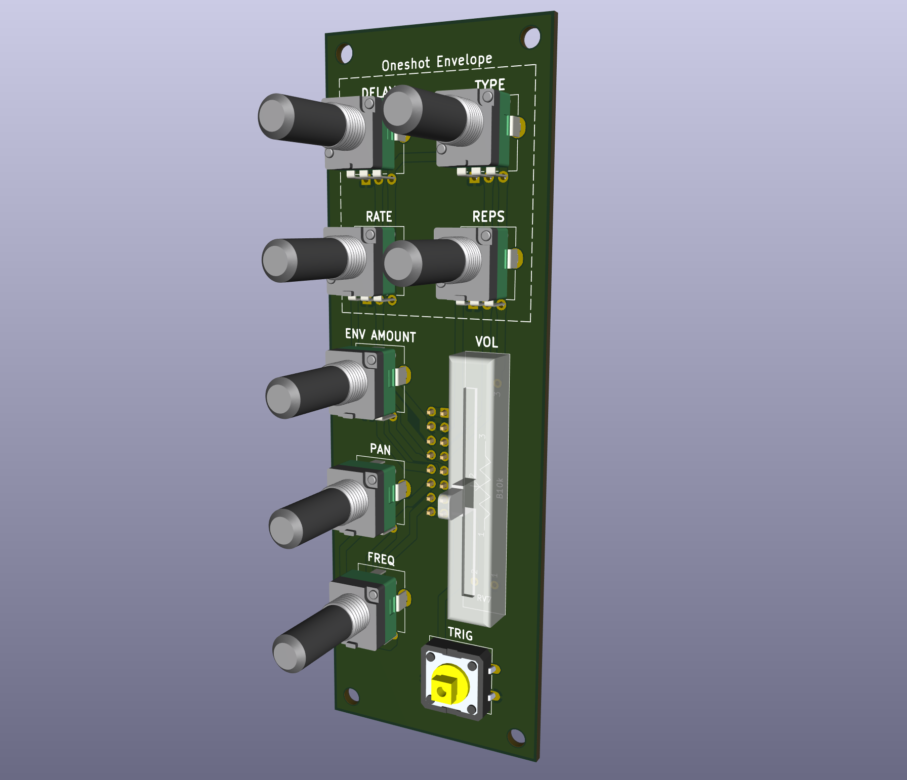
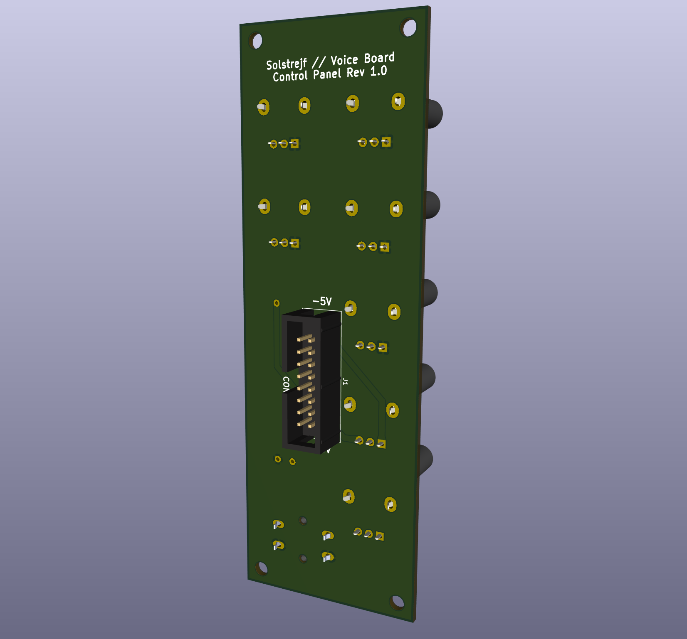

# Solstrejf - 4 Voice Sine Wave Drone Oscillator
This repository contains the simulation, schematic ,and PCB files for **Solstrejf**.
Some custom KiCad footprints, 3D models, and symbols are used in this project. 
This is included as a git submodule, which means that if you want to work with the KiCad projects in this repo, it should be cloned with the `--recursive` option like so: 

```
git clone --recursive "https://github.com/KamikazeVildsvin/Solstrejf.git"
```

### Introduction & Overview
Solstrejf, roughly translated from Danish to "sun streak" or "sun touch", is a four-voice analog sine wave drone oscillator. 
I was on a hike in Sweden out near a beautiful forest lake just around the break of dawn. 
The way the sun interacted with nature gave me a real sense of calm and ease. 
At that moment I thought, what if I could create an instrument that would be able to replicate this feeling? 
A sine wave drone synthesizer came to my mind, similar to the early Musique Concrète test equipment techniques.

###### Block Diagram


I wanted the instrument to be playful and interactive. 
Four sine wave oscillators in itself are maybe not that interesting and can become static. 
A modulation matrix, which would allow for all four voices to modulate parameters like frequency and amplitude on all other voices would create more complex soundscapes. 
The basic idea and block diagram can be seen above, where four identical voice boards are connected to the mod-matrix board and a power supply/mixer board for output summation.

###### Modulation Matrix & Voice Control Interface


The image above is a render of the modulation matrix and four of the voice board control front panels.
This is essentially user interface of the synthesizer.

## PCB's - KiCad Projects
As indicated by the block diagram above, Solstrejf is broken into four different sub-blocks and PCB's:

- A Power Supply Unit (PSU) & Mixer PCB
- A Modulation Matrix PCB
- A Voice board PCB (x4)
- A Voice board Front Panel PCB (x4)

Each of these PCB's have their own KiCad project with an associated schematic. 
The [`schematics`](schematics) directory contains some of the latest prints of the different schematics. 
The revision may not match with the KiCad files, so be sure to double check the actual KiCad project files to be certain.

#### Interactive BOM
All of the four PCB's have an interactive BOM which is generated using the [InteractiveHtmlBom](https://github.com/openscopeproject/InteractiveHtmlBom) KiCad plugin.
The interactive bom allows to see where the components should be placed on the board and also have a checklist build in, which makes it much easier to assemble the PCB's.
You can also export the BOM to a CSV or TXT file for a more traditional BOM.

### PSU / Audio Mixer
Use to generate the +/-15V supply and sum all of the left and right audio channels of the four voices.

[KiCad Project Files](pcb/solstrejf-PSU-mixer/)

[Link to interactive BOM](https://html-preview.github.io/?url=https://github.com/KamikazeVildsvin/Solstrejf/blob/master/pcb/solstrejf-PSU-mixer/bom/ibom.html)

###### PCB


###### 3D Model : Top View


###### 3D Model : Side View


### Mod-Matrix
Connects to each of the four voice boards to route the modulation from and to each of the voices.
Each voice can modulate the amplitude, frequency and pan of all other voices.

[KiCad Project Files](pcb/solstrejf-modmatrix-pots)

[Link to interactive BOM](https://html-preview.github.io/?url=https://github.com/KamikazeVildsvin/Solstrejf/blob/master/pcb/solstrejf-modmatrix-pots/bom/ibom.html)

###### PCB 


###### 3D Model : Front-Side


###### 3D Model : Back-Side 


### Voice board 
The voice board is the actual sine wave oscillator and control voltage board.
Solstrejf consists of four of these voice boards.

[KiCad Project Files](pcb/solstrejf-voiceboard-core/)

[Link to interactive BOM](https://html-preview.github.io/?url=https://github.com/KamikazeVildsvin/Solstrejf/blob/master/pcb/solstrejf-voiceboard-core/bom/ibom.html)

###### PCB


###### 3D Model : Top View


###### 3D Model : Side View


### Voice board Front Panel
The voice board needs a control interface for the base pan, frequency, and volume. All of the potentiometers that control the voice board are located on this front panel for easier assembling. 

[KiCad Project Files](pcb/solstrejf-voiceboard-frontpanel/)

[Link to interactive BOM](https://html-preview.github.io/?url=https://github.com/KamikazeVildsvin/Solstrejf/blob/master/pcb/solstrejf-voiceboard-frontpanel/bom/ibom.html)

###### PCB 


###### 3D Model : Front Side


###### 3D Model : Back Side 


# Prototype Sponsorship - PCBWay
[PCBway](https://www.pcbway.com/) was so kind to reach out and offer to sponsor the first batch of all four PCBs for Solstrejf!
Essentially, they paid for the production of 5x of each of the four PCBs, which was a great help to reduce the cost of this project.

It was very easy to order from PCBWay using the [PCBWay KiCad Export Plugin](https://github.com/pcbway/PCBWay-Plug-in-for-Kicad).
With one click, all of the needed Gerber and drill files were created and packaged in a neat zip file that could be uploaded directly to PCBWay's website for ordering.

I'm very satisfied with the build quality of the PCBs that I have received for my first prototype of Solstrejf.
The silkscreen and edge cuts were very smooth and pleasant to look at, which especially is nice for the modulation matrix and the voice board front panels (since the user has to look at these PCBs).

Thanks to PCBWay for sponsoring the prototype PCBs.

*pictures coming soon...*